# <center>分布式系统期末项目报告</center>


| 院系：计算机学院 计算机科学与技术2班 | 年级：19                    |
| ------------------------------------ | --------------------------- |
| 学号姓名：19335374 张震宇            | 联系方式：1582240351@qq.com |


## 一、项目内容

本项目实现了一个 client-server 架构的分布式文件系统。本文件系统支持多用户，实现文件多个副本的存储以及多副本之间的一致性问题。本文件系统参照了 HDFS 的原理来实现


## 二、开发环境

- 语言：Python 3.9.2
- IDE：Pycharm
- 平台：win10
- 通信方式：gRPC


## 三、基本功能

|   命令   |            参数            |                           功能描述                           |
| :------: | :------------------------: | :----------------------------------------------------------: |
|  upload  |        [local_path]        |             将本地路径下的文件上传到问文件系统中             |
| download |       [origin_path]        | 将远程文件系统中的文件拷贝到本地系统中。该操作会在本地创建[origin_path]中所需的文件目录 |
|  delete  |       [origin_path]        |                将远程文件系统中对应的文件删除                |
|    cd    |        [origin_dir]        |        打开远程文件系统中某个文件夹，支持打开多级目录        |
|    ls    |        可选：[dir]         | 列出对应文件目录中的文件，该指令默认列出当前目录下的文件与文件目录 |
|  mkdir   |           [dir]            |          在远程文件系统指定的路径下新建一个文件目录          |
|   open   | [origin_path] [permission] | 打开远程系统中指定路径文件，并按照permission参数指定的权限打开。1表示写权限打开，0表示读权限打开 |
|  close   |       [origin_path]        |        关闭远程文件系统中已打开的文件，并释放相应的锁        |
|   exit   |             -              |                           退出系统                           |


## 四、项目原理

### 1、概述

本文件系统在实现原理上参照了课上介绍过的分布式文件系统 HDFS。在我们的系统中，服务器端主要有两个不同的角色，分别是 `nameNode`和`dataNode`，在架构原理上使用了Master/Slave 架构。

- `nameNode`在系统中充当 Master 角色，主要负责文件系统命名空间的维护和系统中元数据的储存和管理。在我们系统中`nameNode`支持的对文件系统命名空间的操作主要包括文件目录的创建、打开、关闭和查询等。 `nameNode`同时还负责为文件系统中的用户提供一个最开始的访问接口，负责对客户端对文件系统的访问。在最终的实现中，我们仿照 HDFS，文件系统只存在唯一一个`nameNode`。
- `dataNode` 在系统中充当 Slave 的角色。与 `nameNOde` 不同，在系统中可以同时存在多个 `dataNode`。`dataNode` 主要负责存储的功能。在 HDFS 中，`dataNode`储存的是已经分好块的文件。考虑到我们存储的文件通常较小，并且在实现过程中为了简化系统实现，我们的文件系统在存储的时候不对文件进行分块，而是直接存储整个文件


### 2、文件的读取

在实现的原理之前，我们先将文件操作抽象为两种：文件的读取与文件的写入。我们文件系统的读写原理依循 HDFS ，下面先介绍文件的读取。


文件的读取主要分为三个阶段：

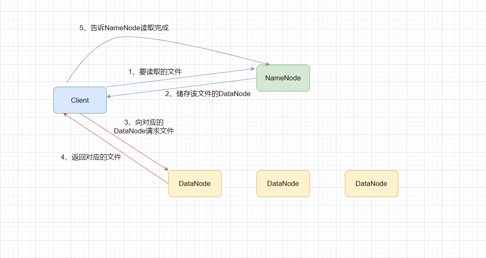

#### 阶段一：数据的索引

- Client 先向 `nameNode` 发送要访问的文件名以及文件路径，`nameNode`开始检索本地的文件目录（文件系统命名空间）。
- `nameNode`找到储存相应文件的`dataNode`，并将返回一个`dataNode`列表和一个文件key值给Client，并为文件加锁。

#### 阶段二：数据的传输

- Client 通过将`nameNode`返回的信息，在`dataNode`列表中选择一个，并向该`dataNode`请求数据
- `dataNode`在收到请求后，通过文件key值检索节点本地的文件，并将结果返回给 Client

#### 阶段三：读取完成

- Client 向`nameNode`发送一个操作成功的消息后，完成文件读取操作
- `nameNode`在收到 Client 发送的成功读取的消息之后，释放相应的锁


### 3、文件的写入

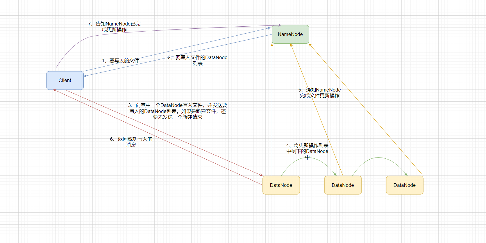

文件的写入如上图，分为了四个不同的阶段

#### 阶段一：文件的索引

- CLient 向 `nameNode` 请求写入文件
- `nameNode`返回储存该文件的`dataNode`列表

#### 阶段二：文件的传输

- Client 选择列表中的一个`dataNode`，并向其执行文件写入操作。与读取阶段不同，此时Client 还需要将列表中剩下的`dataNode`告知选择的节点
- 被选中的节点执行文件写入操作。在系统执行完写入操作之后，`dataNode`通知 Client 写入操作完成

#### 阶段三：系统同步

- 在通知 Client 完成更新之前，被首先选中的节点还要通知列表中其他的`dataNode`执行更新操作。
- 在`dataNode`执行完写操作之后，还要通知`NameNode`当前节点执行了写入操作。如果用户执行的是创建或者是删除文件的操作，`NameNode`在收到确认通知后还需要执行对文件目录的更新或删除操作

#### 阶段四：写入完成

- Client在收到写入完成的消息后，通知`NameNode`完成写入操作
- `NameNode`在收到Client写入完成的信息之后，释放相应的锁


### 4、文件目录的更新

在我们实现的系统中，文件目录（文件系统命名空间）的维护是完全交由`nameNode`负责的。`dataNode`只负责文件的存储，文件目录结构对于`dataNode`而言是透明的。这种做法保证了我们的系统只需要保证`nameNode`中的信息的正确性便能处理系统一致性的问题。

文件目录的更新操作只涉及到 Client 和`nameNode`两个节点，Client 向`nameNode`发送对应的文件目录操作（在这里我们实现了`ls`、`cd`、`mkdir`三种文件目录操作），`nameNode`执行相应的操作，并将执行的结果返回给 Client。


## 五、代码实现

### 1、文件目录的实现

文件目录在形式上是一棵多叉树的结构。考虑到直接使用树结构来储存文件目录较为复杂，而且不好将处于内存中文件目录储存到磁盘空间中。在这里我们使用了 Python 的字典来进行表示文件目录。具体的格式如下：

```json
"root":{
    "dir1":{}
    "dir2":{
    	"dir2_1":{
    		"filename": [ [nid, nid], key]
		},
		"dir2_2":{},
	}
	"dir3":{}
},
"key_num": num
```

其中，对于文件夹，我们将表示为一个 `dir:{}` 键值对。而对于文件，我们表示为一个 `filename:[ [nodes], key ]`的键值对形式，其中，`[nodes]`中储存的是文件所在 `dataNode` 对应的`nid`，而`key`表示的是某一文件对应的`key`值。`dataNode`通过查询对应的`key`值来实现文件的索引。


### 2、文件的读取

考虑到如果实现文件部分读取难度太大，这里我们在实现文件读取的时候是直接将整个文件读取下来。实现的代码如下：

Client 文件：

```python
    def downloadFile(self, filename):
        src_path = self.curr_path + filename
        local_path = self.root + src_path
		
        # main_stub对应的是nameNode的桩函数，action=0表示的是读取
        response = self.main_stub.getDataNode(
            nameNode_pb2.ClientFileRequest(
                path=src_path,
                action=0,
            )
        )
		
        if response.state == 0:
            print("System: fail to download the file: ", src_path)
            return

        if len(response.nodes) == 0:
            print("System: The file not exist")
            return
        
        # 选择其中一个节点来读取文件
        node = response.nodes[-1]
        response.nodes.pop()
        channel = grpc.insecure_channel(node.ip + ':' +node.port)
        stub = dataNode_pb2_grpc.dataNodeStub(channel)
        response_data = stub.read(
            dataNode_pb2.ClientReadRequest(
                key=response.key
            )
        )

        self.saveChunk(response_data, local_path)
        print("System: File downloaded successfully")
        
        # 文件储存完成之后，向nameNode发送成功读取的信息
        self.main_stub.wave(
            nameNode_pb2.ClientFinish(
                action=0,
                key=response.key
            )
        )
```


nameNode文件：

```python
    def getDataNode(self, request: nameNode_pb2.ClientFileRequest, context):
        norm_path = os.path.normpath(request.path)
        path = norm_path.split(os.sep)
        action = request.action
        nodes, key = [], -1
        # 如果是新建文件操作，则不用检索文件目录
        if action != 2:
            # 检索文件目录，取出相应的dataNode列表和文件key值
            nodes, key = self.locateFromDir(path)
            # 如果文件不存在，直接返回失败
            if key == -1:
                return nameNode_pb2.ClientFileRespond(state=0)
            # 如果文件正在被其他用户读取，直接返回失败
            # 如果是创建文件，则不需要加锁
            if self.write_lock_table[str(key)] != 0:
                return nameNode_pb2.ClientFileRespond(state=0)

        # 处理用户读文件
        if action == 0:
            self.lockFile(key, 0)
            ret_nodes = []
            for i in nodes:
                ret_nodes.append(
                    nameNode_pb2.dataNode(
                        id=i,
                        ip=self.node_list[i]["ip"],
                        port=self.node_list[i]["port"]
                    )
                )
            return nameNode_pb2.ClientFileRespond(state=1, nodes=ret_nodes, key=key)

        # 处理用户写
        if action == 1:
            # 如果此时有用户正在读该文件，则拒绝执行写操作。这种做法有可能会造成写饥饿
            if self.read_lock_table[str(key)] != 0:
                return nameNode_pb2.ClientFileRespond(state=0)
            self.lockFile(key, 1)
            ret_nodes = []
            for i in nodes:
                ret_nodes.append(
                    nameNode_pb2.dataNode(
                        id=i,
                        ip=self.node_list[i]["ip"],
                        port=self.node_list[i]["port"]
                    )
                )
            return nameNode_pb2.ClientFileRespond(state=1, nodes=ret_nodes, key=key)

        # 处理用户删除文件
        if action == -1:
            # 有用户正在读文件，禁止删除文件
            if self.read_lock_table[str(key)] != 0:
                return nameNode_pb2.ClientFileRespond(state=0)
            self.lockFile(key, 1)
            if self.deleteFile(path, key, nodes):
                return nameNode_pb2.ClientFileRespond(state=1)
            else:
                return nameNode_pb2.ClientFileRespond(state=0)

        # 处理用户创建文件
        if action == 2:
            key = self.directory["key_num"] + 1  # 文件的新编号
            ret_nodes = random.sample(self.node_list.keys(), int((len(self.node_list) + 1)/2))
            if len(ret_nodes) != 0:
                for i in ret_nodes:
                    nodes.append(
                        nameNode_pb2.dataNode(
                            id=i,
                            ip=self.node_list[i]["ip"],
                            port=self.node_list[i]["port"]
                        )
                    )
                return nameNode_pb2.ClientFileRespond(state=1, nodes=nodes, key=key)
            else:
                return nameNode_pb2.ClientFileRespond(state=-1)

        return nameNode_pb2.ClientFileRespond(state=0)
```

DataNode文件：

```python
    # 读取文件，并以流式传输的方式发送给Client
    def read(self, request: dataNode_pb2.ClientReadRequest, context):
        print('DataNode ' + str(self.id) + ' : begin transition')
        # 通过key值检索文件
        filename = self.file_list[str(request.key)]
        with open(self.root + filename, 'rb') as fp:
            while True:
                chunk = fp.read(1024 * 1024)
                if len(chunk) == 0:
                    fp.close()
                    return
                yield dataNode_pb2.Chunk(buffer=chunk)
```


### 3、文件写入

文件写入也类似，我们在实现过程中是将整个文件写入

Client文件：

```python
    def uploadFile(self, filename, action):
        # src_path = self.root + self.curr_path + filename
        src_path = self.root + filename
        origin_path = self.curr_path + filename
		
        if not os.path.exists(src_path):
            print("System: files does not exit")
            return
		
        ## 向nameNode请求dataNode
        response = self.main_stub.getDataNode(
            nameNode_pb2.ClientFileRequest(
                path=origin_path,
                action=action,  # 1:写 2:创建
            )
        )
        if response.state == 0:
            print("System: The file is locked")
            return
        if response.state == -1:
            print("System: Upload file error!!")
            return

        if len(response.nodes) == 0:
            return
		
        ## 选择其中一个dataNode
        node = response.nodes[-1]
        response.nodes.pop()
        channel = grpc.insecure_channel(node.ip + ':' + node.port)
        stub = dataNode_pb2_grpc.dataNodeStub(channel)
        ## 发送请求节点的信息
        stub.create(
            dataNode_pb2.ClientCreateRequest(
                key=response.key,
                file_name=filename,
                path=origin_path,
            )
        )
        chunk_generator = self.getChunk(src_path, response.key)
        try:
            response_data = stub.write(chunk_generator)
            if response_data.state == 1:
                nodes = []
                for node in response.nodes:
                    nodes.append(
                        dataNode_pb2.dataNodeInfo(
                            id=node.id,
                            ip=node.ip,
                            port=node.port,
                        )
                    )
                stub.syncWrite(
                    dataNode_pb2.ClientSyncRequest(
                        nodes=nodes,
                        key=response.key,
                    )
                )
                print("System: success to upload file: ", src_path)
            else:
                print("System: fail to upload file: ", src_path)
        except Exception as err:
            print(err)

        response_finish = self.main_stub.wave(
            nameNode_pb2.ClientFinish(
                action=action,
                key=response.key,
            )
        )
        if response_finish.state == 1:
            print("System: creation finish")
```

DataNode文件：

```python
    def syncWrite(self, request: dataNode_pb2.ClientSyncRequest, context):
        nodes = request.nodes
        key = request.key
        if len(nodes) == 0:
            return dataNode_pb2.ClientRespond(state=1)
        # 向nodes中的一个点更新信息
        node = nodes[-1]
        nodes.pop()

        channel = grpc.insecure_channel(node.ip + ':' + node.port)
        stub = dataNode_pb2_grpc.dataNodeStub(channel)
        chunk_generator = self.chunkGen(key)
        try:
            stub.create(
                dataNode_pb2.ClientCreateRequest(
                    key=key,
                    file_name=self.file_list[str(key)],
                    path=self.file_path[str(key)],
                )
            )
            response = stub.write(chunk_generator)
            stub.syncWrite(
                dataNode_pb2.ClientSyncRequest(
                    key=key,
                    nodes=nodes,
                )
            )
            dataNode_pb2.ClientRespond(state=1)
        except Exception as err:
            print(err)
            return dataNode_pb2.ClientRespond(state=0)
            
 # 同步写操作
     def syncWrite(self, request: dataNode_pb2.ClientSyncRequest, context):
        nodes = request.nodes
        key = request.key
        if len(nodes) == 0:
            return dataNode_pb2.ClientRespond(state=1)
        # 向nodes中的一个点更新信息
        node = nodes[-1]
        nodes.pop()

        channel = grpc.insecure_channel(node.ip + ':' + node.port)
        stub = dataNode_pb2_grpc.dataNodeStub(channel)
        chunk_generator = self.chunkGen(key)
        try:
            stub.create(
                dataNode_pb2.ClientCreateRequest(
                    key=key,
                    file_name=self.file_list[str(key)],
                    path=self.file_path[str(key)],
                )
            )
            response = stub.write(chunk_generator)
            stub.syncWrite(
                dataNode_pb2.ClientSyncRequest(
                    key=key,
                    nodes=nodes,
                )
            )
            dataNode_pb2.ClientRespond(state=1)
        except Exception as err:
            print(err)
            return dataNode_pb2.ClientRespond(state=0)
```


## 六、系统演示

### 初始状态


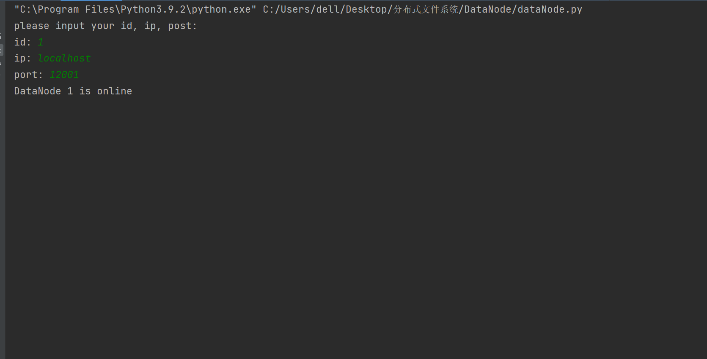

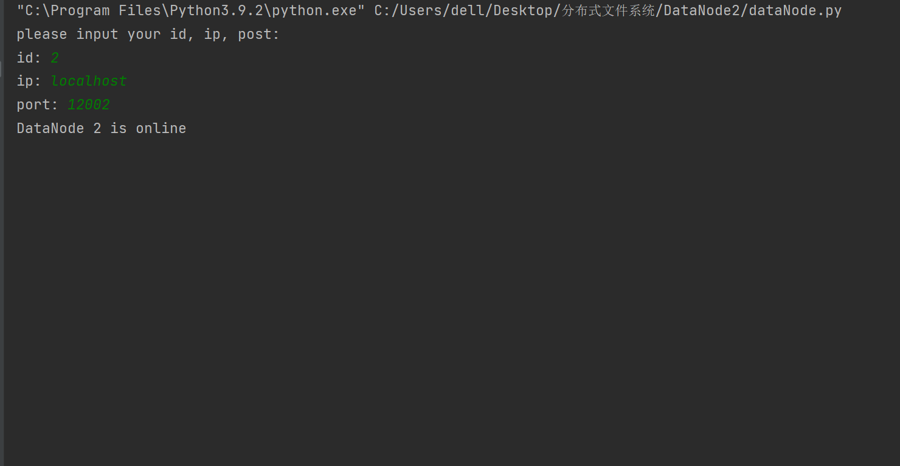

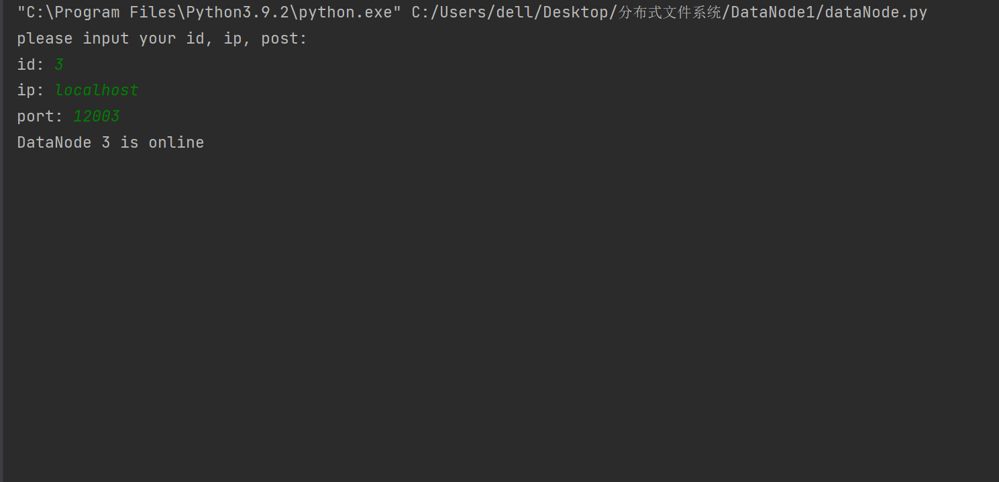

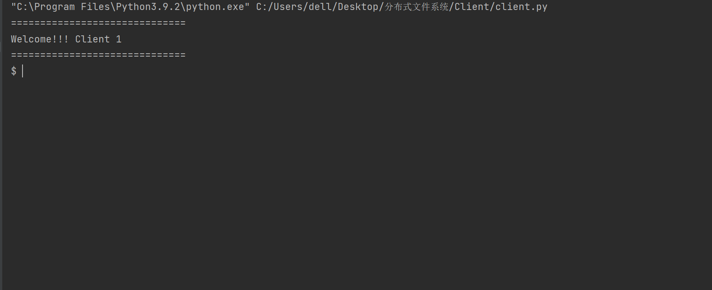

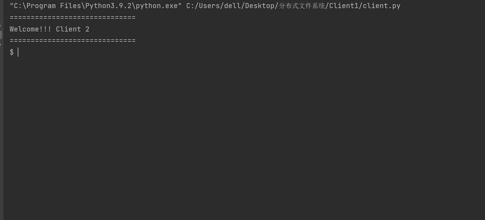


### 创建文件夹

初始时我们的文件系统为空

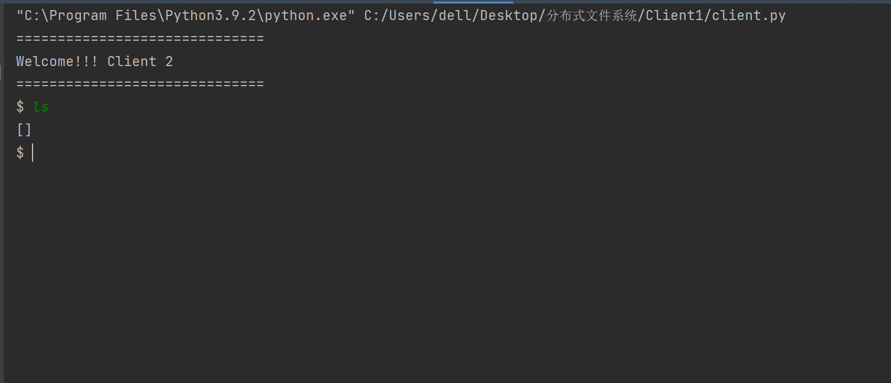

创建一个新的文件夹

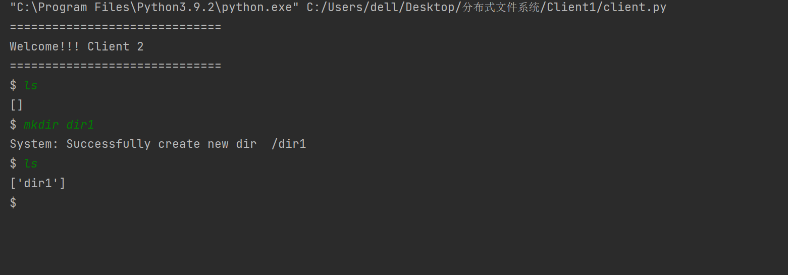

Client 1中可以看到Client 2 创建的文件夹

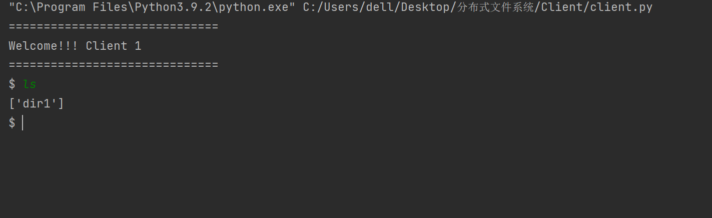


### 文件读写

Client 1上传文件

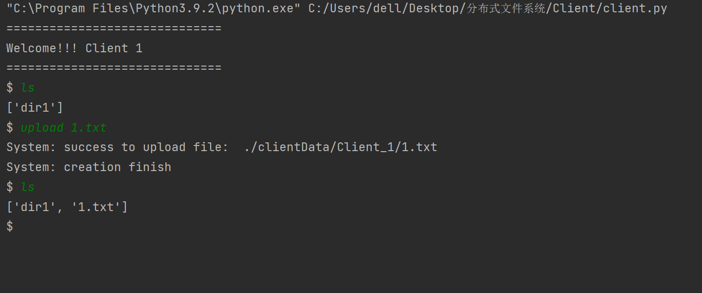

Client 2中可以看到

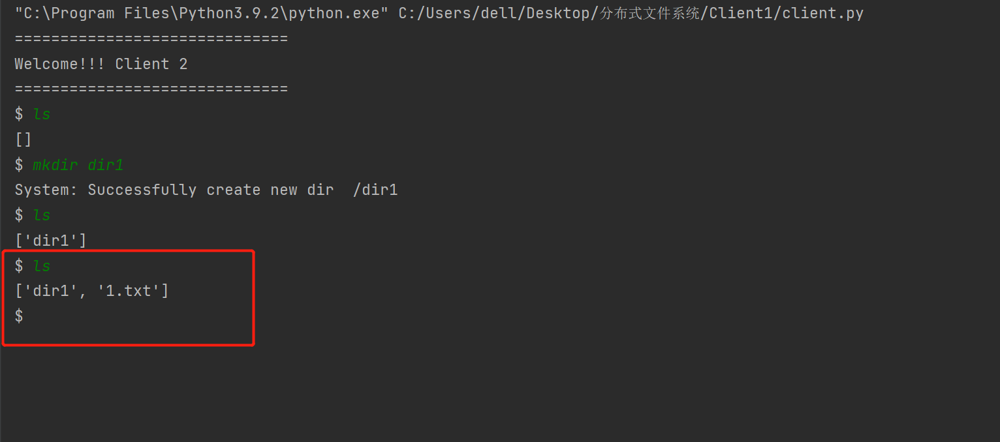

Client 2下载 Client 1上传的文件


Client 2的文件夹中可以看到下载下来的文件


添加文件并上传

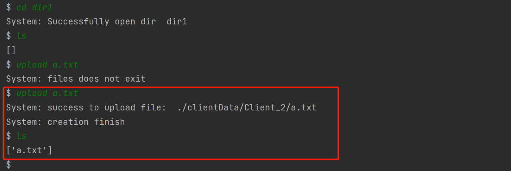

> 上面上传失败只是因为当时忘记创建`a.txt`了

在Client 1中下载Client 2上传的文件

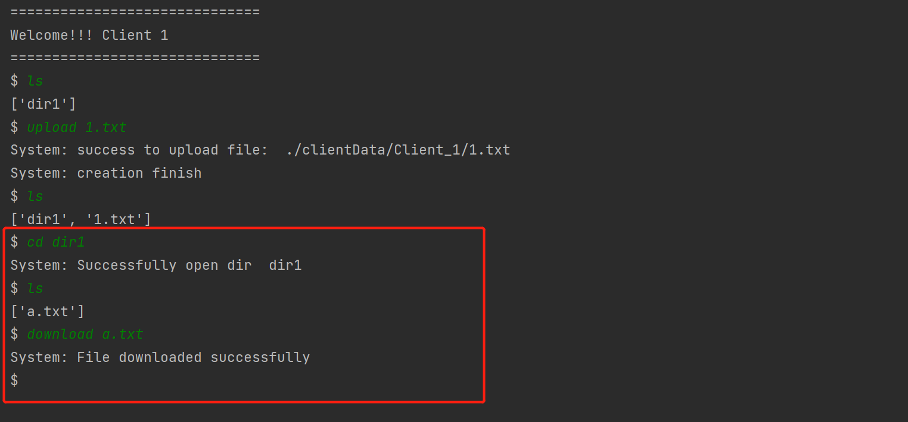


如图，文件下载成功，并且成功同步了文件路径


### 锁机制

Client 1 以写权限打开文件 1.txt

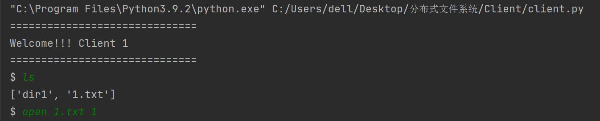

Client 2 无法打开（读和写都不可以）

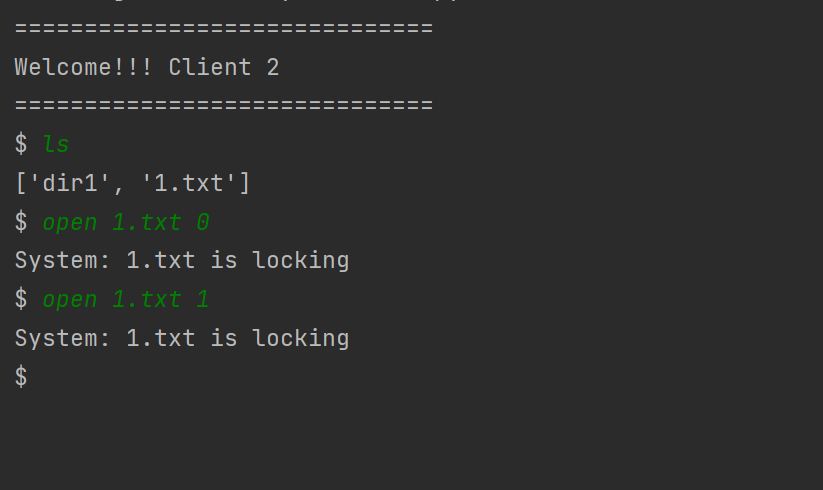

Client 1 关闭文件


Client 2 又可以打开了

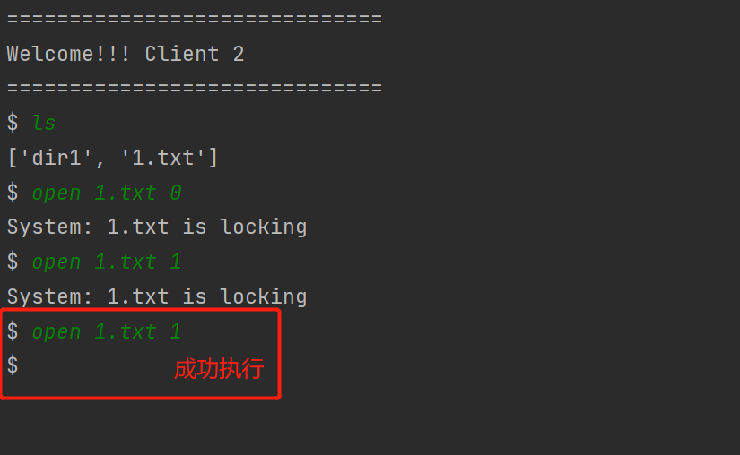

Client 2 关闭文件，重新以读权限打开


同时，Client 1也以读权限打开，可以成功打开

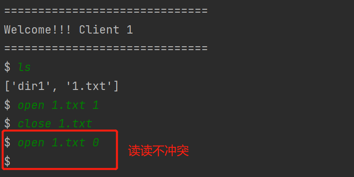


### 副本机制

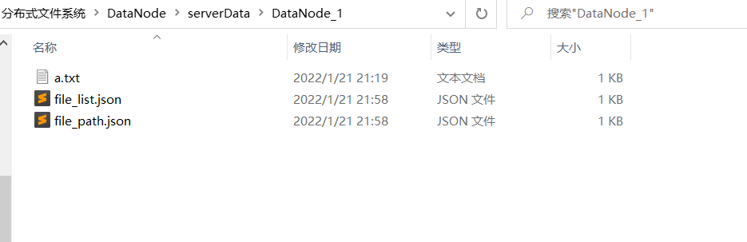

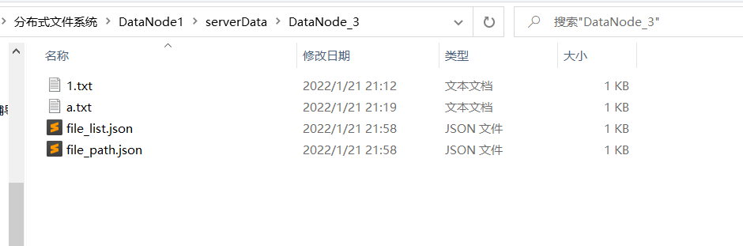

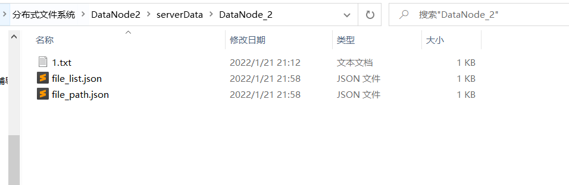


nameNode的根文件如下：

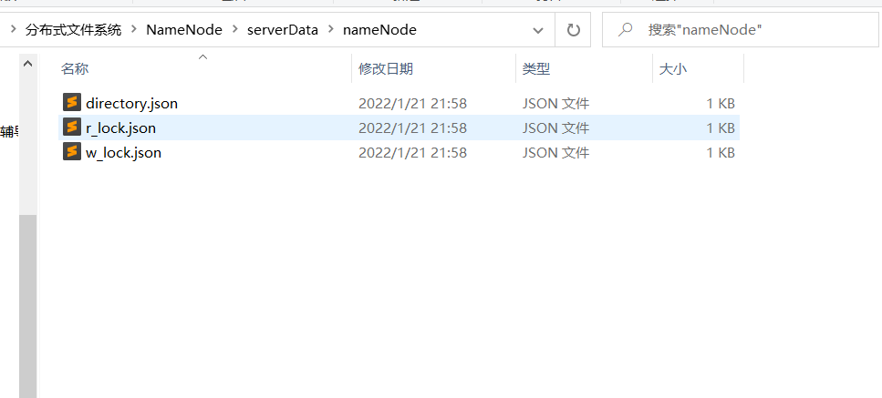